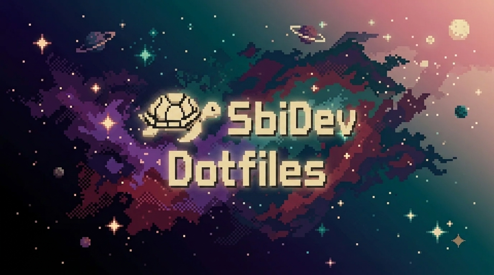

 

<div align="center">

# Dotfiles by SbiDev-447 


**Colección de dotfiles, configuraciones y scripts** diseñados para el compositor [Niri](https://github.com/YaLTeR/niri) en **Debian 13 Trixie**.  
Incluye personalización de entorno, gestión de energía, lanzadores rápidos con **Fuzzel**, editor **Neovim** potenciado con **LazyVim** (Basado en GentlemanDots), y utilidades CLI propias.
</div>

---

## 📋 Scripts Incluidos

Todos los scripts están pensados para ubicarse en `~/.local/bin/` y **no requieren extensión** para ejecutarse directamente.

* **`niri-custom-launcher`**: Lanzador CLI con acceso rápido a `btop` (monitor), `fastfetch` (información) y `nmtui` (red).
* **`fuzzel-power-menu`**: Menú interactivo de apagar, reiniciar, bloquear y suspender.
* **`fuzzel-launcher`**: Menú principal integrador (agrupa energía, herramientas CLI y selector de wallpapers).
* **`fuzzel-Wallpaper`**: Selector dinámico de Wallpapers (solo admite .webp) con soporte para subcarpetas en `~/Imágenes/Wallpapers/`, transiciones rápidas con `swaybg` y persistencia en `/tmp/last_wallpaper.txt`.
* **`lock-screen`**: Bloqueo con `swaylock` (colores oscuros OLED-friendly), apagado de pantallas y suspensión automática.
* **convertMyBackgrounds:** Convertidor CLI automatico de Imagenes con formatos distintos a .webp en ~/Imágenes/Wallpapers/ de forma recursiva (busca en subcarpetas), pide confirmación para eliminar archivos residuales (Imágenes con extension de formato ya convertidas a webp).
---

## 🔧 Requisitos e Instalación

### Dependencias

```bash
# Instalación en Debian
sudo apt install fuzzel swaybg swaylock kitty btop fastfetch nmtui 

# Para nvim like LazyVim seguir los pasos de GentlemanDots o de la pagina oficial de LazyVim
```

## 🐛 Solución de Problemas

    Fuzzel o Swaylock no abren: Verifica la instalación con which fuzzel o which swaylock.

    Los wallpapers no cambian: Revisa la ruta ~/Imágenes/Wallpapers/ y confirma que swaybg se esté ejecutando con ps aux | grep swaybg.

    Permisos denegados: Asegúrate de dar permisos de ejecución con chmod +x ~/.local/bin/*.

## 📄 Licencia y Contribuciones

Este repositorio usa **dos licencias** diferentes:

- **MIT**: Aplica a todos los archivos de configuración (nvim, niri, etc.) y a los scripts que no indiquen lo contrario.
- **GPL-3.0**: Aplica específicamente a los scripts que incluyan la cabecera GPL en su interior.

Cada archivo con licencia GPL tiene una cabecera que lo indica claramente.

Las contribuciones son bienvenidas.

<div align="center">

**Hecho con ❤️ por SbiDev-447**

Inpirado por el queridisimo [Gentleman Programming / Alan Buscaglia](https://github.com/Gentleman-Programming/Gentleman.Dots). 

Copyright (c) 2026 SbiDev-447.

</div>
