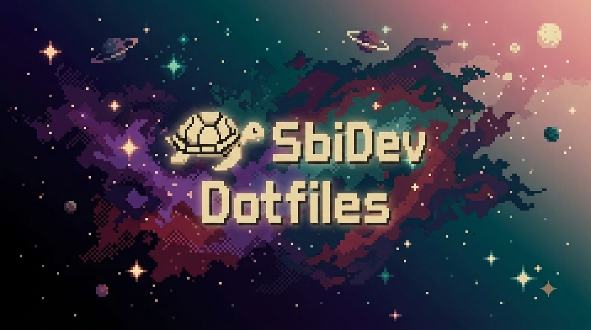

<div align="center">

# Dotfiles by SbiDev-447


**Colección de dotfiles, configuraciones y scripts** diseñados para el compositor [Niri](https://github.com/YaLTeR/niri) en **Debian 13 Trixie**.  
Incluye personalización de entorno, gestión de energía, lanzadores rápidos con **Fuzzel**, barra de estado **Waybar**, terminal **Kitty** con tema oscuro y claro, terminal **Foot** con el tema claro SbiDev, editor **Neovim** potenciado con **LazyVim** (basado en GentlemanDots), y utilidades CLI propias.
</div>

---

## 🔑 Atajos de Teclado Principales (Niri)

### Lanzadores y sistema

| Atajo | Acción |
|-------|--------|
| `Mod+D` | Abrir Fuzzel (launcher principal) |
| `Mod+F1` | Menú integrador (dmenu) |
| `Mod+W` | Selector de wallpapers (fuzzel-Wallpaper) |
| `Mod+Shift+W` | Wallpaper aleatorio siguiente |
| `Mod+E` | Selector de emojis |
| `Mod+BackSpace` | Abrir kitty + tmux + nvim en `~/turtleShell` |
| `Mod+Space` | Gestor de archivos (Thunar) |
| `Mod+Shift+T` | Alternar modo ahorro OLED / presentación |
| `Mod+Shift+Q` | Bloquear pantalla |
| `Mod+Shift+P` | Apagar monitores |
| `Mod+N` | Alternar temperatura de color (wlsunset) |
| `Mod+Shift+Escape` | Salir de Niri |

### Navegación — modelo de columnas

Niri no organiza las ventanas en un mosaico libre: lasAGRUPa en **columnas**. Cada columna
es una pila vertical, y la pantalla las coloca una al lado de otra. Entender esto explica
todos los atajos de navegación.

| Atajo | Acción |
|-------|--------|
| `Mod+Left` / `Mod+Right` | Foco: columna a la izquierda / derecha |
| `Mod+Up` / `Mod+Down` | Foco: ventana arriba / abajo **dentro** de la columna |
| `Mod+H` / `Mod+L` | Igual que `Left` / `Right` (atajos vim) |
| `Mod+J` / `Mod+K` | Igual que `Down` / `Up` (atajos vim) |
| `Mod+Ctrl+flechas` | **Mover** la columna o la ventana (igual que el foco, pero desplazando) |
| `Mod+Shift+flechas` | Foco: monitor a la izquierda / derecha |
| `Mod+Ctrl+Shift+flechas` | Mover columna a otro monitor |
| `Mod+1-9` / `Mod+Shift+1-9` | Ir al workspace / mover la columna al workspace |
| `Mod+Comma` / `Mod+Period` | Absorber ventana en la columna / expulsarla |
| `Mod+R` / `Mod+Ctrl+R` | Ancho de columna siguiente / resetear alto de ventana |
| `Mod+B` | Vista de pestañas dentro de la columna |
| `Mod+V` / `Mod+Shift+V` | Flotar ventana / cambiar entre flotante y en mosaico |
| `Mod+O` | Vista general de columnas |
| `Mod+Q` | Cerrar ventana |

### Capturas y sistema

| Atajo | Acción |
|-------|--------|
| `Print` | Abrir el overlay de captura (eliges región o ventana) |
| `Ctrl+Print` | Capturar la pantalla completa al instante |
| `Alt+Print` | Capturar la ventana activa al instante |

> Consulta `~/.config/niri/config.kdl` para la lista completa de binds.

---

## 🚀 Scripts Detallados

### Gestión de Energía y Pantalla

| Script | Descripción | Dependencias |
|--------|-------------|--------------|
| `swaylock-lock-screen` | Bloqueo con paleta OLED-friendly, apaga monitores y suspende | swaylock, niri, systemctl |
| `niri-idle.sh` | Daemon de inactividad: 180 s → brillo 30%, 300 s → brillo 10% y apaga monitores, 600 s → suspende. Al bloquear baja el brillo y apaga la pantalla; al desbloquear y al volver de suspender, la enciende y deja el brillo al 50% | swayidle, brightnessctl, niri, systemctl |
| `toggle-idle.sh` | Alterna swayidle on/off (modo presentación vs ahorro OLED) | pgrep/pkill, notify-send |
| `fuzzel-power-menu` | Menú interactivo: bloquear+suspender, reiniciar, apagar | fuzzel, systemctl |

### Lanzadores y Selector de Wallpapers

| Script | Descripción | Dependencias |
|--------|-------------|--------------|
| `dmenu` | Hub principal: energía, tema, emojis, utilidades y wallpapers | fuzzel |
| `fuzzel-custom-launcher` | Menú de utilidades: btop, fastfetch, nmtui (las tres dentro de kitty) | fuzzel, kitty, btop, fastfetch, nmtui |
| `fuzzel-Wallpaper` | Selector de wallpapers WebP con soporte de subcarpetas | fuzzel, swaybg, find |
| `niri_wallpaper.sh` | Rotador aleatorio de wallpapers con persistencia de shuffle | swaybg, shuf, notify-send |
| `convertMyBackgrounds` | Conversor recursivo de imágenes a WebP con confirmación | ImageMagick (convert) |
| `emojipicker.sh` | Selector de ~1500 emojis con búsqueda fuzzy; copia al clipboard y lo escribe en la ventana activa | fuzzel, wl-clipboard, wtype |
| `toggle-theme-kitty.sh` | Alterna el tema de kitty commenting y descomentando el `include` de `kitty-theme.conf` / `kitty-theme-light.conf` dentro de los marcadores `# BEGIN_KITTY_THEME`. Recarga kitty con `SIGUSR1` | sed, grep, pkill |
| `toggle-theme-waybar.sh` | Alterna Waybar moviendo el symlink `style.css` entre `styles/dark.css` y `styles/light.css`. Recarga waybar con `SIGUSR2` | sed, ln, pkill |

### Utilidades CLI

| Script | Descripción |
|--------|-------------|
| `updateallsystem` | Actualizador completo: apt + flatpak + nix |
| `low-battery-notify.sh` | Avisos de batería al 30%, 20%, 10% y 5% descargando, y al alcanzar el techo de carga. Los dispara Waybar con `battery.events` al cambiar de estado: sin bucle `sleep`, sin `acpi` y sin `spawn-at-startup` |
| `ufw-help` | Hoja de referencia rápida para comandos UFW |

---

## ⚙️ Configuraciones Incluidas

### Niri (`config.kdl`)
- **Outputs**: eDP-1 (1920x1080) en `x=0` y HDMI-A-1 (1920x1080) en `x=1920`, uno al lado del otro
- **Layout**: modelo de columnas, `gaps 6`, sin borde ni sombra
- **Focus-ring**: grosor 2.5; inactivo gris `#505050`, activo con degradado `#FFBF00` → `#9381FF`
- **Tamaños**: anchos de columna en presets de 1/3, 1/2 y 2/3 (por defecto 1/2); alturas de ventana igual
- **Cursor**: Win7OS-cursors, tamaño 40
- **Autostart**: solo cuatro procesos — `wlsunset` (curva de temperatura por hora), `waybar`, el rotador de wallpapers y el daemon de inactividad. Los avisos de batería no arrancan desde aquí: Waybar los dispara con `battery.events`
- **Sin `window-rule`**: este config no define reglas por aplicación. El flotado se controla a mano con `Mod+V` y `Mod+Shift+V`

### Fuzzel (`fuzzel.ini`)
- Fuente: IosevkaTerm Nerd Font 14pt
- Match mode: fuzzy (fzf-style)
- Terminal: kitty
- **Temas**: hay dos paletas en `themes/`, `Turtle47-Light` y `Owl47-Dark`. Ojo: `fuzzel.ini` solo carga `Turtle47-Light`, que es un tema **claro** mientras el resto del escritorio (kitty, waybar) va en oscuro. Para el oscuro, cambia la línea `include=` por `Owl47-Dark.ini`

### Neovim (LazyVim)
- Distribución: LazyVim (basado en GentlemanDots), con `lazyvim.json` declarando 11 extras oficiales
- **Extras**: `dap.core`, `harpoon2`, `mini-files`, `mini-surround`, y los lenguajes `clangd`, `cmake`, `go`, `json`, `markdown`, `typescript` y `typescript.biome`
- **Plugins propios** en `lua/plugins/`: blink (autocompletado), oil, fzflua, twilight, live-server, markdown, nvim-dap, rip, vim-tmux-navigation y which-key, más los de interfaz y editor (`ui`, `editor`, `colorscheme`, `overrides`)
- `lua/plugins/disabled.lua` desactiva a propósito bufferline, avante, CopilotChat, opencode, codecompanion, precognition, smear-cursor y claudecode
- Spellcheck: vocabularios personalizados EN/ES en `spell/`

### Waybar (`config.jsonc` + `modules.json`)
- **Posición**: arriba y en capa superior (`position: top`, `layer: top`)
- **17 módulos**: workspaces de niri, reloj, CPU, memoria, temperatura, privacidad, MPRIS, red, Bluetooth, micrófono, batería, volumen, brillo y cuatro lanzadores de un clic (dmenu, menú de energía, LocalSend y CachyOS)
- **Volumen y brillo**: módulos `custom` con script propio. Muestran `NN%` junto al icono, sobre una píldora de color, y sin tooltip. El brillo se lee con `brightnessctl --class=backlight`
- **Batería**: el porcentaje va en la barra, no en el tooltip. Waybar lanza `low-battery-notify.sh` mediante `battery.events`, así que no hace falta ningún proceso de avisos aparte
- **CSS**: `style.css` es un symlink que `toggle-theme-waybar.sh` mueve entre `styles/dark.css` y `styles/light.css`, y cada uno importa su paleta (`styles/colors-dark.css` o `styles/colors-light.css`)

> ⚠️ **El módulo de temperatura fija `hwmon-path` a `/sys/class/hwmon/hwmon5/temp1_input`**, que es específico de esta máquina. En otro equipo hay que apuntarlo al `hwmon` correcto o el módulo se queda en blanco. Umbrales: aviso a 70 °C, crítico a 80 °C.

### Kitty (`kitty.conf`)
- Tema SbiDev con dos variantes: `kitty-theme.conf` (oscuro) y `kitty-theme-light.conf` (claro)
- Fuente: IosevkaTerm Nerd Font 14pt
- **Rendimiento**: `scrollback_lines 10000`, `repaint_delay 10`, `input_delay 3`, `sync_to_monitor yes`
- **Transparencia**: `background_opacity 0.9`
- **`allow_remote_control yes`** para poder mandar órdenes desde Neovim. Ojo: no hay `listen_address`, así que el socket remoto no está activado; si lo necesitas, añade `listen_address unix:/tmp/kitty`
- Tabs con `cmd+1-9`, copiar/pegar con `ctrl+shift+c/v`

### Foot (`foot.ini`)
- Terminal Wayland minimalista con el **tema claro SbiDev** (misma paleta que kitty light)
- Fuente: IosevkaTerm Nerd Font 14pt
- Paleta SbiDev light: fondo crema `#f5efe6`, texto `#2a2a2a`, `alpha 0.925`, selección azul `#2a3d5c`
- Cursor bloque mostaza `#d9b45a` con blink, scrollback 10000

### Fastfetch
- Logos ASCII personalizados (`logoSbiDev.txt`, `logoGengarASCII.txt`, `logoRowlet.txt`, `logoSamurott.txt`, `logoSnorlax.txt`)
- Módulos: OS, Kernel, Terminal, Packages (apt), Uptime, CPU, Memory, Disk, Battery

---

## 🔧 Requisitos e Instalación

### Dependencias

```bash
# Dependencias core
sudo apt install fuzzel swaybg swaylock kitty foot btop fastfetch nmtui brightnessctl

# Para el rotador de wallpapers y notificaciones
sudo apt install libnotify-bin imagemagick

# Para el selector de emojis
# wl-copy pega en el clipboard; wtype escribe el emoji en la ventana activa
sudo apt install wl-clipboard wtype

# Para la gestión de energía
sudo apt install swayidle wlsunset playerctl

# Neovim (LazyVim)
# Seguir los pasos de GentlemanDots o la página oficial de LazyVim
```

### Instalación

```bash
# Clonar el repositorio
git clone https://github.com/SbiDev-447/Dotfiles-SbiDev.git
cd Dotfiles-SbiDev

# Copiar configuraciones
cp -r SbiDev-Niri/niri ~/.config/          # Config de Niri
cp -r SbiDev-Fuzzel/fuzzel ~/.config/      # Config de Fuzzel
cp -r SbiDev-Kitty/kitty ~/.config/        # Config de Kitty
cp -r SbiDev-Foot/foot ~/.config/          # Config de Foot
cp -r SbiDev-Waybar/waybar ~/.config/      # Config de Waybar
cp -r SbiDev-NVIM/nvim ~/.config/          # Config de Neovim
cp -r SbiDev-Fastfetch/* ~/.config/fastfetch/ # Config de Fastfetch

# Enlazar los scripts a ~/.local/bin/
./install-scripts.sh
```

> **¿Cómo funciona `install-scripts.sh`?**
> Crea **enlaces simbólicos** de todos los ejecutables hacia `~/.local/bin/` (que crea si no existe), para que los scripts se actualicen solos al hacer `git pull` sin recapiar nada. Cubre 15 scripts de cinco carpetas:
>
> | Carpeta | Qué aporta |
> |---------|------------|
> | `SbiDev-CLI-Scripts/` | `updateallsystem`, `ufw-help`, `low-battery-notify.sh`, `convertMyBackgrounds` |
> | `SbiDev-Fuzzel/` | `dmenu`, `emojipicker.sh`, `fuzzel-custom-launcher`, `fuzzel-power-menu`, `fuzzel-Wallpaper` |
> | `SbiDev-Niri/` | `swaylock-lock-screen`, `toggle-idle.sh`, `niri-idle.sh`, `niri_wallpaper.sh` |
> | `SbiDev-Kitty/scripts/` | `toggle-theme-kitty.sh` |
> | `SbiDev-Waybar/scripts/` | `toggle-theme-waybar.sh` |
>
> Los enlaces son **relativos**, así que puedes mover el repo de sitio sin romperlos.
> - Es **idempotente**: si un symlink ya apunta al repo, lo salta con `OK`.
> - Si **ya existe un archivo** con el mismo nombre, lo omite con `SKIP` para no sobrescribir nada.
> - Con `./install-scripts.sh --force` elimina los archivos existentes y los sustituye por symlinks al repo (útil tras migrar de copias a enlaces).

> **Nota**: algunos ficheros llevan rutas absolutas de mi máquina (`/home/sbi/`), y hay que ajustarlas a tu usuario:
> - `SbiDev-Kitty/kitty/kitty.conf` → `shell /home/sbi/.nix-profile/bin/zsh`
> - `SbiDev-Niri/niri/config.kdl` → invoca `niri_wallpaper.sh`, `niri-idle.sh`, `emojipicker.sh` y `swaylock-lock-screen` con ruta absoluta
>
> La alternativa más limpia para el `kitty.conf` y el `config.kdl` es sustituir las rutas por `~/.local/bin/...`, que es justo donde `install-scripts.sh` deja los enlaces.
>
> El symlink `SbiDev-Waybar/waybar/style.css` **sí es relativo** (`styles/dark.css`), a propósito: así sobrevive a un `git clone` en otra máquina. `toggle-theme-waybar.sh` lo mantiene relativo al cambiar de tema.

---

## 🐛 Solución de Problemas

| Problema | Solución |
|----------|----------|
| Fuzzel o Swaylock no abren | Verifica la instalación con `which fuzzel` o `which swaylock` |
| Los wallpapers no cambian | Revisa la ruta `~/Imágenes/Wallpapers/` y confirma que `swaybg` esté activo: `ps aux \| grep swaybg` |
| Permisos denegados en scripts | Ejecuta `chmod +x ~/.local/bin/*` |
| Un script no aparece en `~/.local/bin` | `./install-scripts.sh` los enlaza todos; si sigue faltando, comprueba que sea ejecutable en el repo: `test -x <script>` |
| Avisos de batería no aparecen | Verifica el script y su bit de ejecución: `test -x ~/.local/bin/low-battery-notify.sh`, y confirma los eventos con el log de Waybar: `waybar -l debug` |
| Emoji picker no carga | Necesita las dos herramientas: `which wl-copy && which wtype` |
| La temperatura sale vacía | El módulo fija `hwmon-path` a un `hwmon` concreto. Busca el tuyo con `ls /sys/class/hwmon/` y corrígelo en `modules.json` |
| Idle daemon no funciona | Verifica `swayidle`: `which swayidle && pgrep swayidle` |
| Wallpaper rotador no inicia al arrancar | Revisa que `niri_wallpaper.sh` tenga permisos y que la línea de startup esté en `config.kdl` |
| Conversor de imágenes falla | ImageMagick debe estar instalado: `which convert` |

---

## 📄 Licencia

Este repositorio usa **dos licencias** diferentes:

- **MIT**: Aplica a todos los archivos de configuración (nvim, niri, fuzzel, etc.) y a los scripts que no indiquen lo contrario.
- **GPL-3.0**: Aplica específicamente a los scripts que incluyan la cabecera GPL en su interior:
  - `convertMyBackgrounds`
  - `dmenu`
  - `emojipicker.sh`
  - `fuzzel-Wallpaper`
  - `niri_wallpaper.sh`

Cada archivo con licencia GPL tiene una cabecera que lo indica claramente.

Las contribuciones son bienvenidas.

<div align="center">

**Hecho con ❤️ por SbiDev-447**

Inspirado por el queridisimo [Gentleman Programming / Alan Buscaglia](https://github.com/Gentleman-Programming/Gentleman.Dots).

Copyright (c) 2026 SbiDev-447.

</div>

